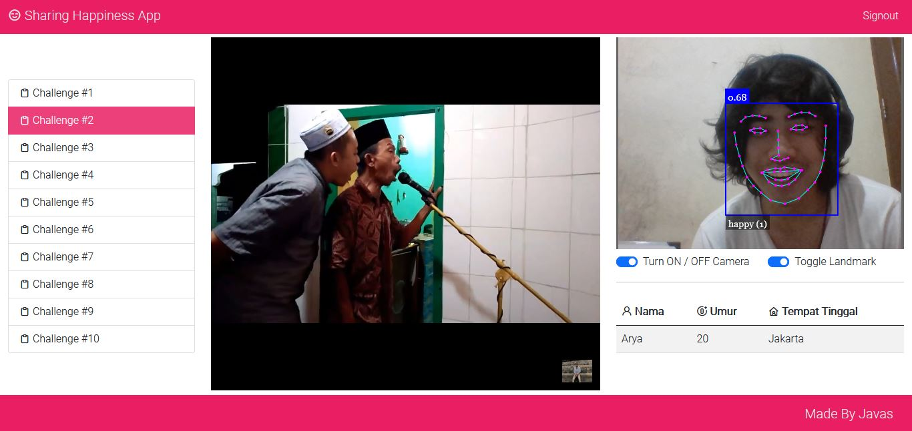
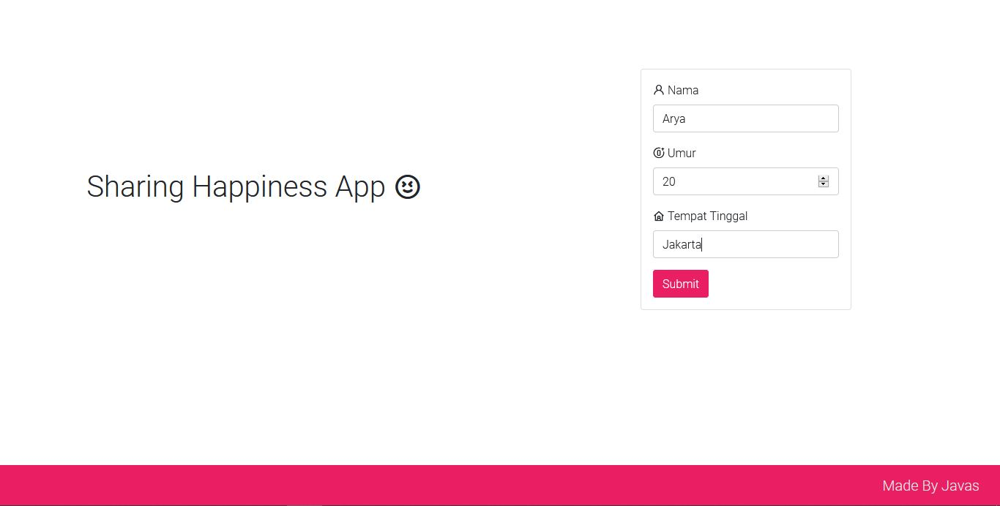
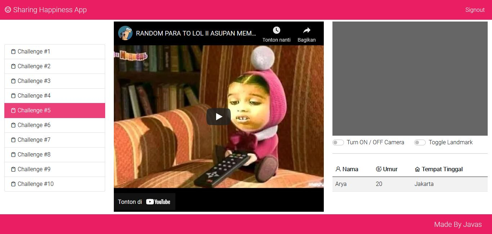
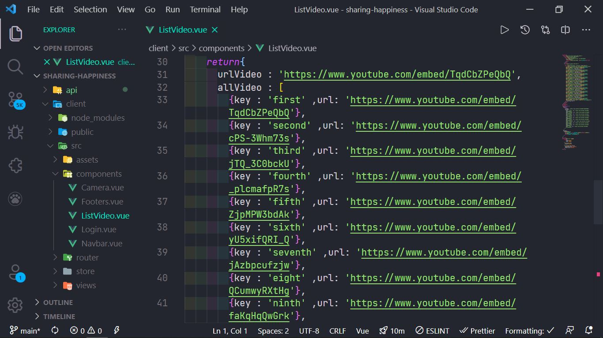

<h1 align="center">Aplikasi Face Recognition Webcam (Sharing Happiness)</h1>
<h3 align="center">Build with Vue 3</h3>



## Deskripsi
<p> Aplikasi ini saya buat agar teman teman dapat menikmati kumpulan vidio lucu dari youtube, sambil melihat ekspresi wajah kalian masing-masing 😄 jika kalian ingin mencoba mengembangkannya, silahkan dinikmati 🥰 </p>

## Live Demo
<h4>https://shappy.digitalinteraktif.com/</h4>

## Screenshoot




## Setup Projek
<p>Silahkan dibuka terlebih dahulu terminalnya<p>
 
```
npm install || Menginstall package Node Modules
npm run serve || Menjalankan server Vue JS
```

<p>Untuk mengubah list video dapat kalian ubah di file ListVideo.vue di folder src/components<p>


<h3 align="center"> Selamat Mencoba 😸 </h3>